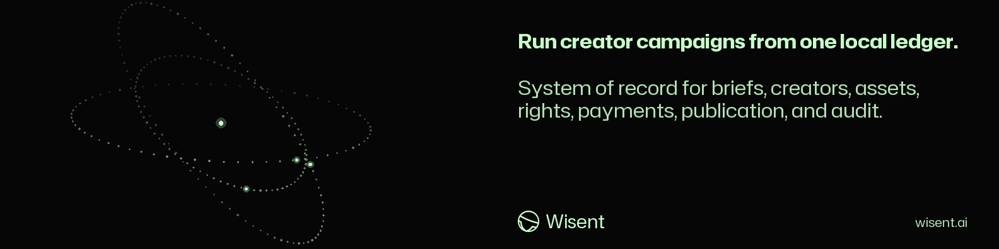

<!-- wisent-banner:start -->
<p align="center">
  
</p>
<!-- wisent-banner:end -->

<!-- wisent-readme-signals:start -->
[](https://github.com/wisent-ai/ugc-cli) [](https://github.com/wisent-ai/ugc-cli/issues) [](https://wisent.com) [](https://discord.gg/qRjpkthq54) [](https://www.linkedin.com/company/wisent-ai/) [](https://x.com/wisentai) [](https://calendly.com/lbartoszcze)
<!-- wisent-readme-signals:end -->

# UGC CLI

Scale Your AI GTM with UGC.

Give your AI Agent a tool to launch campaigns with real creators. Find creators,
generate briefs, track statistics, handle payments — all from one accessible CLI.
All the information you need to communicate with your creators in one API.
Advertise your services as a creator and find opportunities to generate
additional income automatically.

Your Campaign, Scaled by Real Humans.

It provides a standalone ledger and manual-provider workflow without a
creator marketplace, Wisent account, or payment provider. The ledger still
requires a reachable Postgres fleet database; standalone means the work and
local portal do not depend on a hosted creator marketplace.

[Quick start](#quick-start) · [Command surface](#primary-interfaces) ·
[Safety boundaries](#safety-rights-and-compliance) ·
[Canonical repository](https://github.com/wisent-ai/ugc-cli)

Version `0.1.0` is public development source. Hosted collaboration, verified
network access, native provider integrations, money movement, and retained
compliance operation are not implied by the local executable.

## Problem and intended users

Creator campaigns connect personal data, briefs, conversations, physical
shipments, media files, review decisions, usage rights, compensation, publication
URLs, and performance metrics. Spreadsheets and inboxes make it difficult to
prove consent, prevent publication without rights, reconcile what was promised,
or move the record between service providers.

UGC CLI serves:

- **brand and agency operators** coordinating campaigns in a portable local
  workspace;
- **creator managers** retaining profiles, outreach, opt-outs, assignments, and
  conversations;
- **reviewers and rights owners** approving briefs, submissions, technical
  quality, and exact usage grants;
- **finance and compliance operators** recording—not necessarily executing—
  payout state, escrow transitions, publications, attribution, and audit events;
- **developers** integrating authorized providers through explicit adapters,
  webhooks, and idempotent outbox processing.

## First use with an existing ledger

Use the exact record array produced by `standalone export` to start onboarding from data you already own:

```bash
ugc-cli --actor <your-name> onboarding --reset --import ugc-backup.json
```

The walkthrough completes only after the destination accepts the import and reads back a campaign record. Without `--import`, onboarding remains usable with an empty ledger and waits for your first real campaign. The reusable command outside onboarding is:

```bash
ugc-cli --actor <your-name> standalone import ugc-backup.json
```

Both commands call the same store import operation. It validates every record, typed payload, identity, timestamp, and relationship before one transaction in the fleet database writes records and audit entries. Exact records remain unchanged; any conflicting, unsupported, missing, lossy, or noncanonical record refuses the entire import. Rights and payment rows remain ledger data only: import never settles payment, publishes, contacts a creator, or enqueues provider work. Assets remain separate content-addressed files under `UGC_ASSET_DIR` and must be copied with the JSON export.

The root operator screen served by `ugc-cli standalone serve` submits the same record array to authenticated `POST /api/import`; success follows commit, conflicts return 409, and malformed input returns 400. The operation returns `imported`, `unchanged`, `conflicting`, and `rejected` record lists and never prints credential contents.
The same screen creates campaigns, briefs and creators through authenticated `POST /api/campaigns`, `POST /api/briefs` and `POST /api/creators`, calling `campaign create`, `brief add` and `creator add`'s shared service methods. It edits or cancels a campaign, archives a brief and removes a creator through `PATCH /api/campaigns/{id}`, `POST /api/campaigns/{id}/status`, `POST /api/briefs/{id}/archive` and `DELETE /api/creators/{id}`. The result area shows the operation, HTTP status and response (or a network/input failure); an unknown id, a creator assignments still name, an already archived brief, malformed JSON or invalid numeric input does not appear as success.

## Product boundaries

### Included

- local campaign, brief, creator, identity, assignment, shipment, submission,
  asset, rights, payment, publication, attribution, and audit records;
- the fleet database `ugc-cli` as system of record, reached through Stado,
  and content-addressed local asset storage;
- standalone creator discovery, outreach conversations, portal tokens, workflow,
  dashboard, import/export, and local HTTP surfaces;
- deterministic matching and explicit opt-out handling;
- technical asset checks plus separate human review states;
- rights grants and publication checks;
- manual provider connection, outbox, webhook, and replay contracts;
- optional scoped integration points for Brama, Weles, and Skarbiec.

### Explicit non-goals

- UGC CLI does not scrape private creator data, evade platform controls, buy fake
  engagement, conceal sponsorship, or authorize reuse beyond recorded rights.
- Local payment and ledger records do not move money, file tax forms, settle a
  marketplace balance, or establish that a creator was paid.
- Creator verification records operator evidence; it is not identity, audience,
  fraud, or legal verification unless an authorized provider contract says so.
- Technical QC does not replace human creative review or rights approval.
- Publication must fail closed without the required approved brief, submission,
  and valid rights scope.
- The public repository must not contain creator personal data, addresses,
  messages, media, contracts, credentials, campaign plans, payout details, or
  provider-specific private automation.
- Hosted collaboration, managed integrations, payouts, and retained compliance
  evidence are separate services and must fail closed when unavailable.

### Supported environment and current capability

| Surface | Requirement | Current state |
|---|---|---|
| CLI and fleet ledger | Rust compatible with `Cargo.lock`; Stado declaring `ugc-cli` and the `ugc-cli-database-client` bearer | Implemented |
| Local asset store | writable private directory | Implemented |
| Standalone portal/API | explicit loopback bind and local workspace | Implemented local surface |
| Manual provider adapter/outbox | explicit connection | Implemented contract |
| Brama/Weles/Skarbiec paths | separately configured scoped services | Optional |
| Native marketplace integrations | provider authorization and contract review | Not generally included |
| Real payment rails | payment provider and compliance operation | Not implemented by local ledger |
| Hosted team workspace/directory | managed entitlement | Separate service surface |

## Core use cases

### Create and plan a campaign

- **Actor:** a brand or agency operator.
- **Initial state:** campaign name, brand, product, markets, channels, currency,
  and optional budget/deadline are explicit.
- **Outcome:** the local ledger creates a campaign that can receive versioned
  briefs and assignments.
- **Boundary:** campaign creation contacts no creator and commits no spend.

### Match and engage creators

- **Actor:** an authorized campaign operator.
- **Initial state:** consented or lawfully held creator profiles, identities,
  campaign criteria, and an outreach policy exist.
- **Outcome:** deterministic discovery and conversation records preserve why a
  creator was considered, contacted, accepted, or opted out.
- **Boundary:** native marketplace or messaging access requires a separately
  authorized adapter; opt-outs must remain effective.

### Review content and usage rights

- **Actor:** a reviewer and rights owner.
- **Initial state:** an assignment, submission, imported content-addressed asset,
  and proposed usage scope exist.
- **Outcome:** technical QC, human review, and a rights receipt remain distinct;
  publication checks can reject missing or expired scope.
- **Boundary:** ownership and legal sufficiency remain human/legal decisions; a
  hash proves retained bytes, not that the uploader owned them.

### Record compensation and publication

- **Actor:** an authorized finance or publication operator.
- **Initial state:** assignment, amount/currency, rights, approved content, and
  an external transaction or publication fact exist.
- **Outcome:** the local ledger retains state transitions, publication metadata,
  performance metrics, attribution, and audit evidence.
- **Boundary:** the ledger never substitutes for payment-provider confirmation,
  tax/compliance review, platform disclosure, or creator consent.

## How UGC CLI works

```text
campaign -> brief -> creator match -> assignment -> shipment
                                      │
                                      ▼
conversation -> submission -> content-addressed asset -> QC -> human review
                                                        │
                                                        ▼
                payment record <- rights grant -> publication gate
                         │                              │
                         └──────── audit / export ──────┘
```

The fleet database `ugc-cli` is authoritative for the operational ledger. The asset directory is
content-addressed storage. Provider connections translate explicit external
events through an outbox/webhook boundary. External marketplaces, carriers,
payment processors, publication platforms, and legal records remain authoritative
for their own facts.

## Quick start

This path records one campaign in the fleet ledger and lists it. It contacts no
provider, sends no message, moves no money, and publishes nothing.

### Prerequisites

- Git;
- the Rust toolchain compatible with `Cargo.lock`;
- a reachable Postgres database: Stado may declare `ugc-cli` for consumer
  `ugc-cli`, with the dedicated `ugc-cli-database-client` grant able to read
  the resolved item's URL and certificate fields; alternatively set
  `UGC_CLI_DATABASE_URL` and `UGC_CLI_DATABASE_CA_FILE` for a direct connection.
  A direct server connection refuses a missing CA file before connecting;
- a private local directory for assets.

```bash
git clone https://github.com/wisent-ai/ugc-cli.git
cd ugc-cli
cargo build --locked
cargo run --locked -- --actor "$USER" campaign create \
  --name "Quick start" \
  --brand "Example brand" \
  --product "Example product" \
  --markets US \
  --languages en \
  --channels short-video \
  --currency USD
cargo run --locked -- --actor "$USER" campaign list
```

Expected result: `campaign create` prints the new record and `campaign list`
returns it from the fleet database.

Through Stado, every command reaches the ledger in four steps, and a failure
names the step: `stado database resolve ugc-cli --consumer ugc-cli --json`
names the credential item; `stado service directory connect skarbiec
--consumer ugc-cli --json` names the route; `stado credentials get
<resolved-item> --field pooler_url --route <resolved-url> --consumer
ugc-cli-database-client --grant-file
~/.stado/ugc-cli-database-client-skarbiec-token` and the same read with
`--field ca_certificate` give the URL and root certificate under the product
grant, not the credential-store administrator. The connection is verified
against that certificate. A refusal reads `the fleet database could not be
reached at step <step>: <Stado's answer>`. Stado and the grant are found under
`UGC_FLEET_HOME`, else `HOME`.

Never use a repository checkout or shared temporary directory for real creator
personal data, messages, addresses, media, contracts, or payout records.

## Primary interfaces

The installed executable is `ugc-cli`. Every invocation names who acts with
the global `--actor` argument (the audit record carries it) and the private
asset directory with `--asset-dir` or `UGC_ASSET_DIR`; nothing is assumed.
Every command prints its answer as JSON; global `--json` selects it explicitly.
Global `--text` prints the same answer as one `path: value` line per field for
a person. The flags conflict before the ledger opens. Onboarding uses these
same flags: text is the screen walk and JSON is one result document.

| Command family | Contract |
|---|---|
| `connection` | provider connection lifecycle and health; `connection edit` changes its name, base URL, token or webhook-secret source, or external account and keeps its provider and sync cursor; `connection remove` is refused while an assignment, creator identity or publication names it (`connection … cannot be removed while these name it: …`) |
| `campaign`, `brief`, `creator`, `assignment` | campaign planning and people/work records; `campaign edit` changes name, objective, deadline or budget and `campaign status <id> cancelled` retires it, `brief archive` retires a draft or approved brief, `creator edit` changes a creator's name, email, languages, markets or niches, `creator identity-remove` takes back one platform identity, `creator remove` removes a creator and their identities and is refused while assignments name them |
| `shipment`, `submission`, `asset` | physical and media delivery lifecycle |
| `rights`, `payment`, `message` | rights, compensation records, and communication; `rights revoke <id> --reason …` keeps the grant as the record of what was licensed, marks it revoked, and `rights check`, release and the campaign workflow stop counting it (`usage rights … are already revoked`) |
| `sync`, `webhook` | explicit outbox and inbound event processing |
| `standalone` | local discovery, conversations, portal, ledger, publication, metrics, dashboard, serve, import/export; `discover` and `launch` return or reach every matching creator unless `--limit` names how many, rank a match by the count of asked-for filters and evidence it meets (engagement and response rates count only against `--min-engagement-rate` and `--min-response-rate` when given), and a portal expires only after the days the caller states with `--days`, `--portal-days` or `serve --portal-days`; `portal-create`, `portal-list [--creator]` and `portal-revoke` cover a creator's portal access, listed with its status and token hash, never the token |
| `automation`, `credential`, `analysis` | a browser action on a creator platform account, a credential source check or vault reference, a model analysis of one record; the Wisent services behind them are adapters |
| `audit`, `diagnostics` | evidence and operator readiness |

Use `ugc-cli <family> --help` for exact subcommands and required fields.

## Safety, rights, and compliance

- Collect the minimum creator data required for a named campaign and legal basis.
- Honor consent, deletion, and opt-out state across imports and adapters.
- Keep creator portal tokens random, hashed at rest, scoped, revocable, and
  separate from operator credentials.
- Require human approval for creative suitability and exact usage scope.
- Record territory, channel, duration, exclusivity, edit rights, paid-media use,
  and expiry explicitly; do not infer them from a generic approval.
- Treat shipment addresses, tax data, payout instruments, private messages, and
  unpublished media as sensitive.
- Disclose sponsorship and platform-required labels; performance metrics do not
  justify fake engagement or platform-policy evasion.
- Reconcile every external payment, shipment, and publication against the
  authoritative provider; an internal status alone is insufficient.

## Operational model

- **Configuration:** the fleet database resolved through Stado, the asset
  directory, actor, and optional provider/service settings.
- **State:** the fleet ledger, content-addressed files, hashed portal tokens,
  outbox, webhook log, and audit records.
- **Credentials:** references belong in Skarbiec or provider-specific secret
  stores; never export secret values with campaign data.
- **Observability:** diagnostics, connection health, sync outbox, webhook log,
  workflow view, dashboard, and audit trail.
- **Recovery:** use standalone export/import plus private database and asset
  backups; reconcile provider-side transactions before replaying outbox work.
- **Cost:** local operation is not metered; managed workspace seats/campaigns and
  pass-through messaging, shipping, media, provider, and payment costs are
  separate and must be explicit.

## Project status and support

- **Maturity:** public development source, version `0.1.0`.
- **Local contract:** complete standalone campaign ledger, portal, rights gate,
  asset store, audit, export, and manual-provider workflow.
- **Managed contract:** hosted collaboration, verified directory, native
  integrations, payouts, retained compliance evidence, and support are separate;
  no availability is promised by this repository.
- **Issues:** [`wisent-ai/ugc-cli`](https://github.com/wisent-ai/ugc-cli/issues).
- **Security and privacy:** use private GitHub Security Advisories; never attach
  creator records, addresses, messages, media, contracts, credentials, payout
  data, customer plans, or private provider traces to a public issue.
- **License:** Apache License 2.0; see [`LICENSE`](LICENSE).